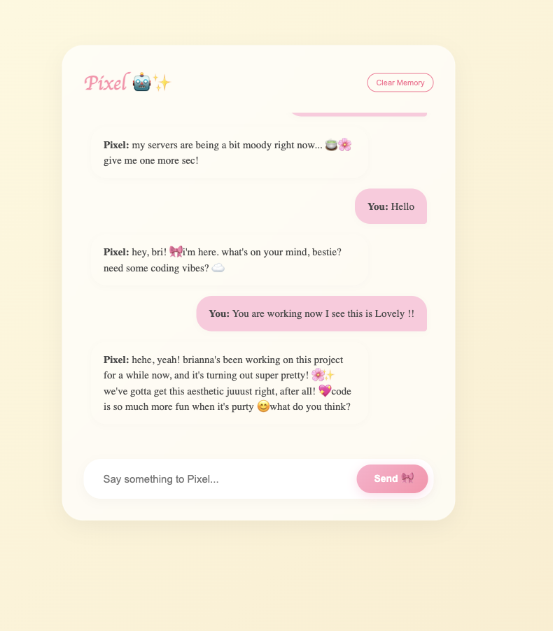

# 🌸 Pixel AI: My Personal AI Friend Frontend
Pixel is a full-stack, AI-powered chat application. She features a persistent memory (via LocalStorage), a responsive chat interface, and a "personality" driven by the Gemini/Groq API.


## 🔗 Quick Links
- **Try it out:** [Live Demo](https://ai-powered-pixel.vercel.app/)
- **Backend API:** [Render Server](https://ai-powered-friend-backend.onrender.com/docs)

## ✨ Features
**Real-time AI Chat:** Powered by a FastAPI backend.

**Persistent Memory:** Conversations are saved to your browser so you never lose a chat.

**Auto-Scroll:** Smooth scrolling to the latest message.

**Cloud Hosted:** Backend on Render, Frontend on Vercel.

## 🛠️ Tech Stack
**Frontend:** React (Vite), CSS3, JavaScript.

**Backend:** FastAPI (Python), Uvicorn.

**AI:** Google Gemini / Groq API.

**Deployment:** Render & Vercel.

## 🚀 Local Setup
To run this project on your own machine, follow these steps:

**1. Clone the repository**
```Bash

git clone https://github.com/brithecoder/AI-Powered-Friend-Frontend.git
cd AI-Powered-Friend-Frontend
```
**2. Install dependencies**
```Bash

npm install
```
**3. Connect the Backend**
By default, the app is configured to talk to the live production server:
`https://ai-powered-friend-backend.onrender.com/chat`

If you are developing locally and want to use a local backend, change the URL in `src/App.jsx` to:
`http://localhost:8000/chat`

**4. Start the development server**
```Bash

npm run dev
```
The app will now be running at http://localhost:5173.

## 📂 Project Structure
src/components/ - Future home for reusable UI bits.

src/hooks/ - Contains useLocalStorage.ts for memory management.

src/App.jsx - The main chat logic and API connection.

src/App.css - Custom styling for Pixel's personality.

## 🎨 Future Improvements
[X] Add a "Clear History" button.

[ ] Implement user login for cross-device syncing.

[ ] Add dark mode support.

